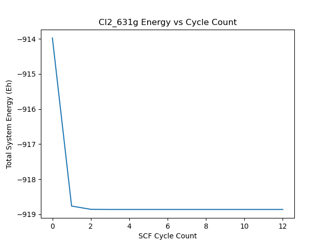

# SCF
Python implementation of Self-Consistent Field Algorithm. Performs restricted and unrestricted hartree-focke calculations with superposition of atomic densities guess and density inversion of iterative subspaces for faster wave-function convergence. 

## How to Use 
This code is primarily an excersise and as such is not intended for pratical use. Nonetheless, simple calculations can be performed at relatively low cost. Performing a calculation is simple. First, initiate a pyscf mol object like so: 

mol = mol = pyscf.gto.M(verbose = 1,atom = [ ['N', (0.0, 0.0, 0.0)], ['N', (1.1, 0.0, 0.0)], ], basis = 'sto-3g', symmetry = False)

Select a basis set, and geometry. Next pass the mol object into my custom built "SCF" class located in the SCF_DIIS.py file: 

k=SCF(mol, DIIS=True, guess='hcore', name='Cl2_631g_No_DIIS', method_type='rhf', spin=0, plot=False, max_cycles=100, verbose=4)  

Select whether you would like to use DIIS, initial orbital guess, output name (for graphing), method (uhf or rhf), spin (for uhf), the max number of SCF cycles, and verbosity of output. Verbosity goes as: 

- 0 : No Output
- 1 : Total Converged System Energy
- 2 : SCF Cycle Count, Run Time
- 3 : dE/dD/total E Per SCF Cycle
- 6 : Full Converged Electron Density Matrix 
                
The convergence tolerances can also be changed as shown in the comments beneath the initialization block.  

## Graphing

The SCF_DIIS.py file can also produce plots of energy change, density change, and total energy as a function of cycle count for convergence monitoring purposes: 

## Sources
The following resources were used in the creation of this code: 
- "Programming the Self-Consistent Field Method Using Python", Alexander Sokolov, OSU
  - https://research.cbc.osu.edu/sokolov.8/wp-content/uploads/2023/05/programming_scf.pdf
- "The Deprince Research Group Programming Projects", Prof. Deprince FSU
  - https://www.chem.fsu.edu/~deprince/programming_projects/diis/

## Dependencies
- python 3.x
- pyscf

